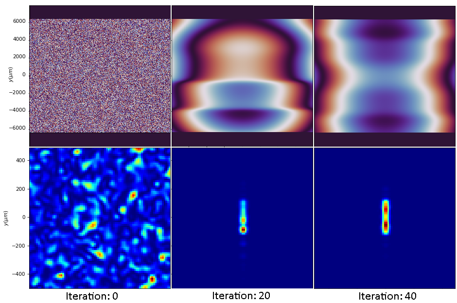
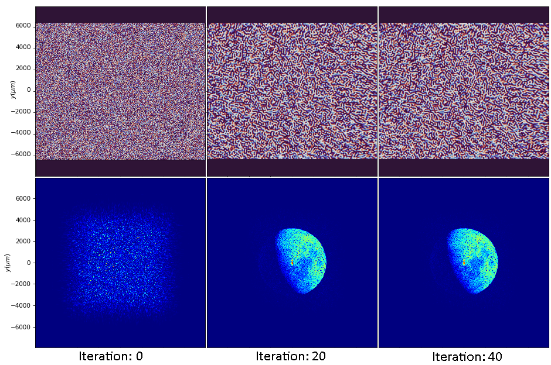

# Simulation-Phase-Retrieval
Codebase for simulating laser propagation through a phase mask and generating phase masks for target intensity distributions using a modified Gerchberg-Saxton algorithm.

### Phase retrieval results

### Setup
Install all necessary modules using:

    pip install -r requirements.txt

In the Diffractio scalar_fields_XY.py module make the following code substitution:

Replace lines 1065-1066:

    else:
        self.u = u_s

With:

    else:
        self.u = u_s
        if xout is not None:
            self.x = self.x + xout - self.x[0]
            self.y = self.y + yout - self.y[0]
            self.X, self.Y = meshgrid(self.x, self.y)

This is to enable applying the RS method in place without specifying xout and yout. The in place operation saves memory.
